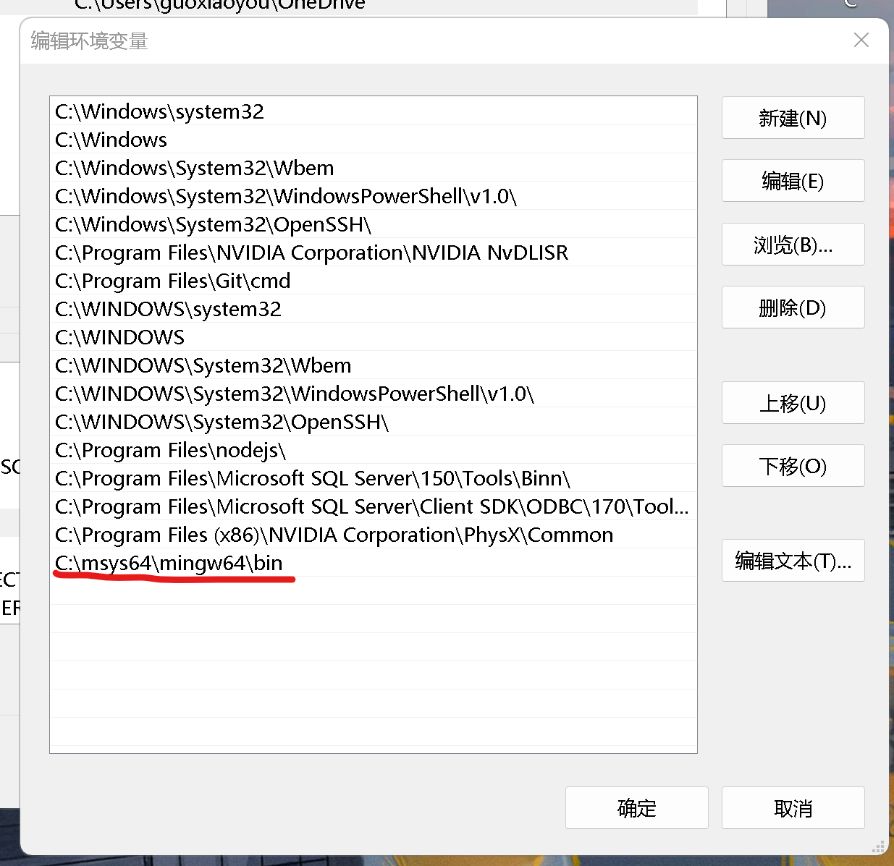
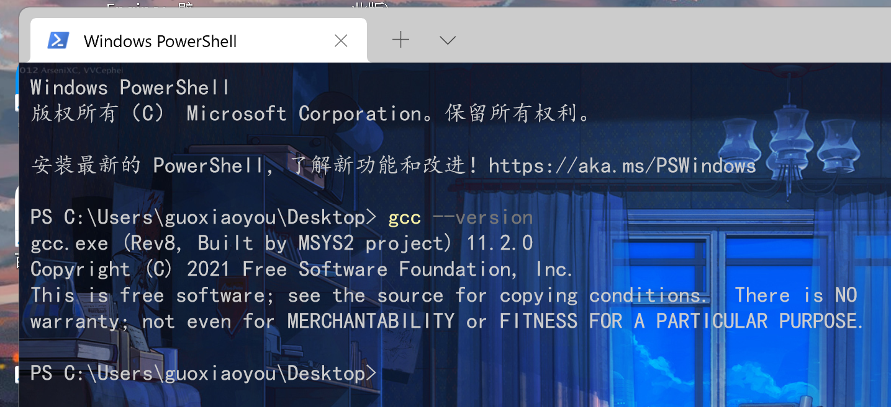
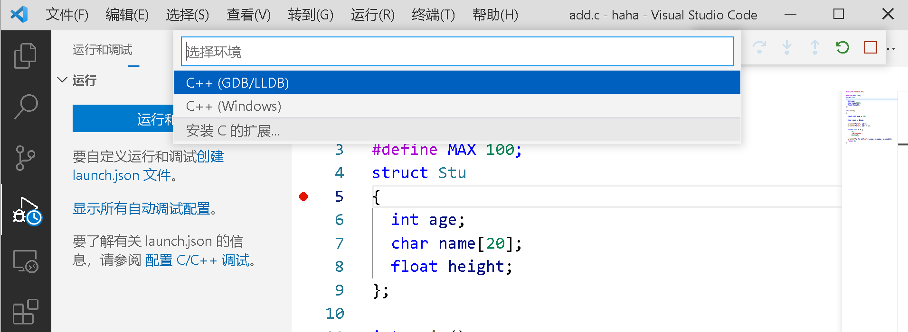
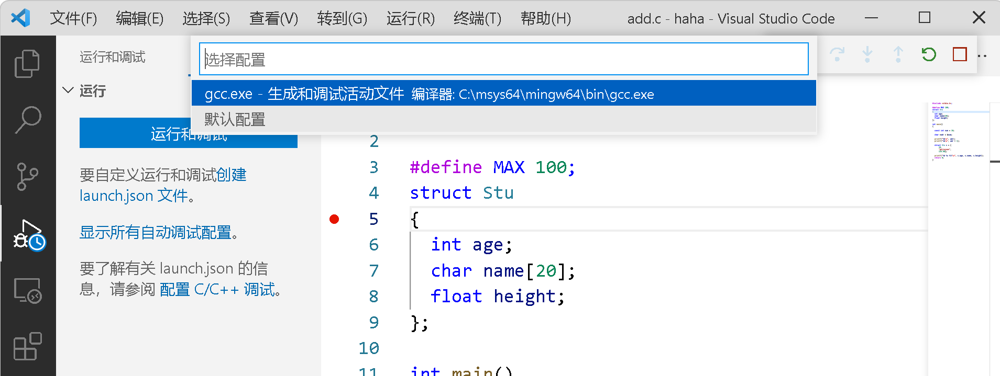
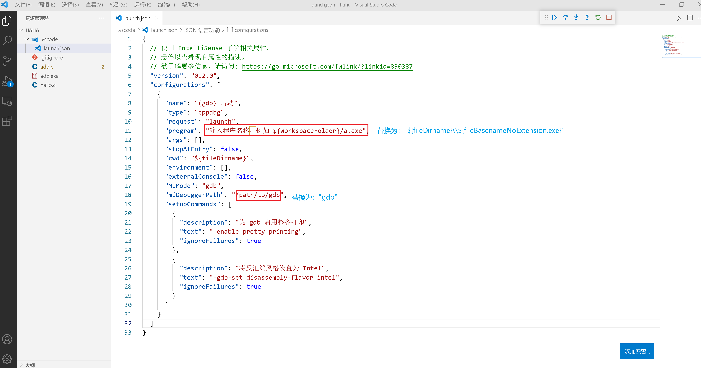
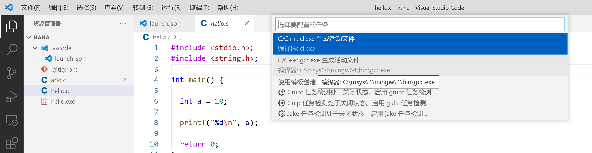
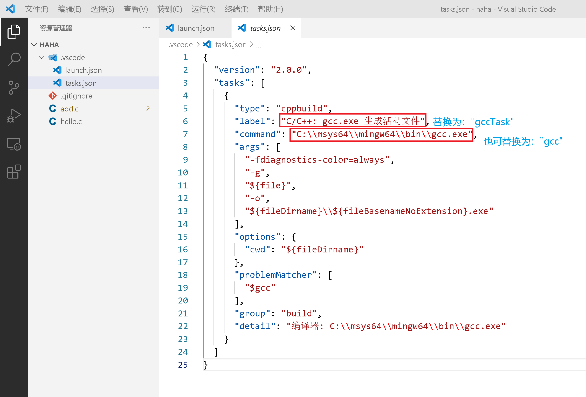
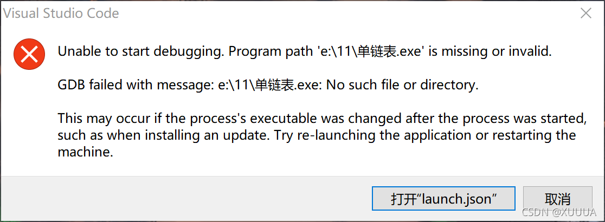

[TOC]


#### 一、安装C/C++扩展


#### 二、安装GCC编译器

微软官方教程中推荐使用[`MSYS2`](https://www.msys2.org/)安装[`MinGW-w64`](https://www.mingw-w64.org/)（为Windows提供完整的GCC和LLVM运行环境）。安装过程需要注意几个点：

1. 如果下载的MSYS2安装包不是最新版本，则需要额外处理两个任务——更新包数据库和基础包。（注意：pacman是MSYS2内置的包管理工具）

   第一步：使用pacman -Syu命令，更新包数据库

   ```
   $ pacman -Syu
   :: Synchronizing package databases...
    mingw32                        805.0 KiB
    mingw32.sig                    438.0   B
    mingw64                        807.9 KiB
    mingw64.sig                    438.0   B
    msys                           289.3 KiB
    msys.sig                       438.0   B
   :: Starting core system upgrade...
   warning: terminate other MSYS2 programs before proceeding
   resolving dependencies...
   looking for conflicting packages...
   
   Packages (6) bash-5.1.004-1  filesystem-2021.01-1
                mintty-1~3.4.4-1  msys2-runtime-3.1.7-4
                pacman-5.2.2-9  pacman-mirrors-20201208-1
   
   Total Download Size:   11.05 MiB
   Total Installed Size:  53.92 MiB
   Net Upgrade Size:      -1.24 MiB
   
   :: Proceed with installation? [Y/n]
   :: Retrieving packages...
    bash-5.1.004-1-x86_64            2.3 MiB
    filesystem-2021.01-1-any        33.2 KiB
    mintty-1~3.4.4-1-x86_64        767.2 KiB
    msys2-runtime-3.1.7-4-x86_64     2.6 MiB
    pacman-mirrors-20201208-1-any    3.8 KiB
    pacman-5.2.2-9-x86_64            5.4 MiB
   (6/6) checking keys in keyring       100%
   (6/6) checking package integrity     100%
   (6/6) loading package files          100%
   (6/6) checking for file conflicts    100%
   (6/6) checking available disk space  100%
   :: Processing package changes...
   (1/6) upgrading bash                 100%
   (2/6) upgrading filesystem           100%
   (3/6) upgrading mintty               100%
   (4/6) upgrading msys2-runtime        100%
   (5/6) upgrading pacman-mirrors       100%
   (6/6) upgrading pacman               100%
   :: To complete this update all MSYS2 processes including this terminal will be closed. Confirm to proceed [Y/n]
   ```

   第二步：从开始菜单中查找——"MSYS2 MSYS"命令行窗口，输入pacman -Su命令，更新剩余的基础包

   ```
   $ pacman -Su
   :: Starting core system upgrade...
    there is nothing to do
   :: Starting full system upgrade...
   resolving dependencies...
   looking for conflicting packages...
   
   Packages (20) base-2020.12-1  bsdtar-3.5.0-1
                 [... more packages listed ...]
   
   Total Download Size:   12.82 MiB
   Total Installed Size:  44.25 MiB
   Net Upgrade Size:       3.01 MiB
   
   :: Proceed with installation? [Y/n]
   [... downloading and installation continues ...]
   ```

2. 安装和更新完MSYS2后，还要安装MinGW-w64工具集

   ```
   $ pacman -S --needed base-devel mingw-w64-x86_64-toolchain
   warning: file-5.39-2 is up to date -- skipping
   [... more warnings ...]
   :: There are 48 members in group base-devel:
   :: Repository msys
      1) asciidoc  2) autoconf  3) autoconf2.13  4) autogen
      [... more packages listed ...]
   
   Enter a selection (default=all):
   :: There are 19 members in group mingw-w64-x86_64-toolchain:
   :: Repository mingw64
      1) mingw-w64-x86_64-binutils  2) mingw-w64-x86_64-crt-git
      [... more packages listed ...]
   
   Enter a selection (default=all):
   resolving dependencies...
   looking for conflicting packages...
   
   Packages (123) docbook-xml-4.5-2  docbook-xsl-1.79.2-1
                  [... more packages listed ...]
                  m4-1.4.18-2  make-4.3-1  man-db-2.9.3-1
                  mingw-w64-x86_64-binutils-2.35.1-3
                  mingw-w64-x86_64-crt-git-9.0.0.6090.ad98746a-1
                  mingw-w64-x86_64-gcc-10.2.0-6
                  mingw-w64-x86_64-gcc-ada-10.2.0-6
                  mingw-w64-x86_64-gcc-fortran-10.2.0-6
                  mingw-w64-x86_64-gcc-libgfortran-10.2.0-6
                  mingw-w64-x86_64-gcc-libs-10.2.0-6
                  mingw-w64-x86_64-gcc-objc-10.2.0-6
                  mingw-w64-x86_64-gdb-10.1-2
                  mingw-w64-x86_64-gdb-multiarch-10.1-2
                 [... more packages listed ...]
   
   Total Download Size:    196.15 MiB
   Total Installed Size:  1254.96 MiB
   
   :: Proceed with installation? [Y/n]
   [... downloading and installation continues ...]
   ```

3. 再打开开始菜单，运行"MSYS MinGW 64-bit"后，便可使用gcc了。

4. 最后一步——添加gcc到系统环境变量中。步骤如下：

   - 右键此电脑，依次选择属性-高级系统设置-高级-环境变量-系统环境变量下的Path，加入gcc.exe文件路径。

     

     路径组成：${MSYS2的安装目录}\mingw64\bin，默认位于C:\msys64\mingw64\bin文件夹里面。

   - 点击确定后打开命令行，输入gcc --version，出现如下内容，即表示添加成功。

     


#### 三、运行调试（debugging）

1. 摁Ctrl+Shift+D切到“运行和调试”左侧面板，依次点击“运行和调试”、C/C++（GDB/LLDB）环境和gcc.exe配置选项。

   



然后生产了.vscode配置目录，其中包含一个launch.json文件，如图：



可以看到，上图中，我基于默认生产的配置做了两处修改：

- 第一个program选项，这是必需的。表示debugger调试器要调试的可执行文件（如.exe文件）路径。这里我们填写为xxx.c源文件的同目录位置的xxx.exe。
- 第二个miDebuggerPath选项，表示VSCode要使用的debugger调试器路径，这里我们改为"gdb"，它是gcc集成的debug程序。而之所以这里只写"gdb"，是因为前面我们已经添加了C:\msys64\mingw64\bin环境变量，所以执行时会找到此目录下的gdb程序，当然，我们也可以填写完整的目录——C:\msys64\mingw64\bin\gdb.exe。

但这还没完，刚刚说了，debugger调试器运行必需基于C语言编译后的可执行文件，而我们如果在编写完xxx.c代码保存后，就运行调试任务，调试器就会因为找不到可执行程序而报错。因此，在调试前我们需要先构建出可执行文件。如：

```
gcc add.c -o add.exe
```

生产.exe可执行文件后，再F5启动调试就ok了。


#### 四、配置任务

你可能会发现，如果要想运行调试，每次都得先手动构建可执行文件，这无疑是非常麻烦的。

此时为方便快速调试，我们可在launch.json中再添加一项配置——preLaunchTask，表示在运行调试前执行一项名为gccTask的任务，如：

```
{ 
  "version": "0.2.0",
  "configurations": [
    {
       ...xxx,
       preLaunchTask: "gccTask",
    }
  ]
}
```

那么，我们便可在gccTask任务中处理可执行文件的构建。顺着这个思路，我们就需要进行如下几步操作：

- 依次点击终端 — 配置任务... — C/C++ gcc.exe

  

- 随即在.vscode下生产tasks.json文件，如：

  

  其中也要做两处替换，一是label，要与launch.json中preLaunchTask一致，说明这就是这个任务的名称。其二是command，表示该任务要执行的命令程序，它默认生成的是gcc编译器程序的完整路径，这里我们也可以替换成"gcc"，因为添加过了环境变量。

至此，我们便可在xxx.c文件中一键F5开启debugger调试和Ctrl+F5（以非调试模式运行）运行任务生成可执行文件。

另外，我们还可以安装Code Runner扩展，以便右键菜单点击run code运行任务，效果等同Ctrl+F5。


#### 五、智能提示

完整c_cpp_properties.json内容：

```
{
    "configurations": [
        {
            "name": "Win32",
            "includePath": [
                "${workspaceRoot}/**",
                "c:/msys64/mingw64/include/**",
                "C:/msys64/mingw64/bin/../lib/gcc/x86_64-w64-mingw32/11.2.0/../../../../include/c++/11.2.0",
                "C:/msys64/mingw64/bin/../lib/gcc/x86_64-w64-mingw32/11.2.0/../../../../include/c++/11.2.0/x86_64-w64-mingw32",
                "C:/msys64/mingw64/bin/../lib/gcc/x86_64-w64-mingw32/11.2.0/../../../../include/c++/11.2.0/backward",
                "C:/msys64/mingw64/bin/../lib/gcc/x86_64-w64-mingw32/11.2.0/include",
                "C:/msys64/mingw64/bin/../lib/gcc/x86_64-w64-mingw32/11.2.0/../../../../include",
                "C:/msys64/mingw64/bin/../lib/gcc/x86_64-w64-mingw32/11.2.0/include-fixed",
                "C:/msys64/mingw64/bin/../lib/gcc/x86_64-w64-mingw32/11.2.0/../../../../x86_64-w64-mingw32/include"
            ],
            "defines": [
                "_DEBUG",
                "UNICODE",
                "__GNUC__=6",
                "__cdecl=__attribute__((__cdecl__))"
            ],
            "windowsSdkVersion": "10.0.19041.0",
            "compilerPath": "C:/msys64/mingw64/bin/gcc.exe",
            "cStandard": "c17",
            "cppStandard": "c++17",
            "intelliSenseMode": "gcc-x64",
            "browse": {
                "limitSymbolsToIncludedHeaders": true,
                "databaseFilename": "",
                "path": [
                    "${workspaceRoot}/**",
                    "c:/msys64/mingw64/include/**",
                    "C:/msys64/mingw64/bin/../lib/gcc/x86_64-w64-mingw32/11.2.0/../../../../include/c++/11.2.0",
                    "C:/msys64/mingw64/bin/../lib/gcc/x86_64-w64-mingw32/11.2.0/../../../../include/c++/11.2.0/x86_64-w64-mingw32",
                    "C:/msys64/mingw64/bin/../lib/gcc/x86_64-w64-mingw32/11.2.0/../../../../include/c++/11.2.0/backward",
                    "C:/msys64/mingw64/bin/../lib/gcc/x86_64-w64-mingw32/11.2.0/include",
                    "C:/msys64/mingw64/bin/../lib/gcc/x86_64-w64-mingw32/11.2.0/../../../../include",
                    "C:/msys64/mingw64/bin/../lib/gcc/x86_64-w64-mingw32/11.2.0/include-fixed",
                    "C:/msys64/mingw64/bin/../lib/gcc/x86_64-w64-mingw32/11.2.0/../../../../x86_64-w64-mingw32/include"
                ] 
            }
        }
    ],
    "version": 4
}
```


#### 六、再多说一下launch.json配置


launch.json的具体可配置项含义为（只介绍部分）：

- program

  必需。调试器要执行的程序（如编译.c后形成的.exe可执行文件）路径

- symbolSearchPath

  可选。查找.pdb文件的目录，特别的，当需要匹配多个路径时，需要使用分号隔开。例如：

  ```
  "C:\\Symbols;C:\\Symbols2"
  ```

  > pdb，全称“程序数据库文件”（Program Database），存储程序的所有调试信息数据。.pdb文件主要会存储对应模块（dll或exe）内部的所有符号，以及符号对应的地址、文件名和行号。当我们调试的时候可能会需要，可以理解为调试时应用程序和源文件之间的桥梁。

- requireExactSource

  可选。用于告诉VSCode Windows调试器需要将当前源代码匹配.pdb文件

- additionalSOLibSearchPath

  可选。告知GDB（gcc debugger调试器）或LLDB搜索.so文件（动态链接库）的目录。同样，也需要用分号隔开多个路径。例如：

  ```
  "/User/dir1; /User/dir2"
  ```

- externalConsole

  可选。是否使用外部命令行（控制台）窗口输出结果

- avoidWindowsConsole Redirection

  可选。为了在Windows上支持VS Code的gdb集成终端，该扩展将控制台重定向命令添加到被调试进程的参数中，以使控制台输入和输出显示在集成终端中。将此选项设置为true将禁用它

- visualizerFile

  调试时使用的.natvis文件。详见：[`创建语言文件的自定义视图`](https://docs.microsoft.com/zh-cn/visualstudio/debugger/create-custom-views-of-native-objects?view=vs-2022)

- showDisplayString

  可选。当指定了visualizerFile时，showDisplayString 将启用显示字符串。 启用此选项可能会导致调试期间性能下降 。如：

  ```
  {
    "name": "C++ Launch (Windows)",
    "type": "cppvsdbg",
    "request": "launch",
    "program": "C:\\app1\\Debug\\app1.exe",
    "symbolSearchPath": "C:\\Symbols;C:\\SymbolDir2",
    "externalConsole": true,
    "logging": {
      "moduleLoad": false,
      "trace": true
    },
    "visualizerFile": "${workspaceFolder}/my.natvis",
    "showDisplayString": true
  }
  ```

- args

  运行时，需要传递给程序的命令行参数，需要使用JSON数组形式。如：

  ```
  // 普通传值
  args: ["arg1", "arg2"]
  
  // 需要转义字符时。结果为：{"arg1":true}
  ["{\\\"arg1\\\":true}"]
  ```

- cwd

  设置调试程序运行时的工作区目录

- environment

  程序运行的环境变量，如：

  ```
  {
    "name": "C++ Launch",
    "type": "cppdbg",
    "request": "launch",
    "program": "${workspaceFolder}/a.out",
    "args": ["arg1", "arg2"],
    "environment": [{ "name": "config", "value": "Debug" }],
    "cwd": "${workspaceFolder}"
  }
  ```

  也可在程序目录下创建project.env文件，来指定所需环境变量，如：

  ```
  # project.env file
  
  # 
  MYENVRIONMENTPATH=C:\\Users\\USERNAME\\Project
  
  # Variables with spaces
  SPACED_OUT_PATH="C:\\This Has Spaces\\Project"
  ```

- MIMode

  指出VSCode要连接的调试器，必须是gdb或lldb

- miDebuggerPath

  调试器的路径（如gdb）。如：

  ```
  // 此时会从系统环境变量中去搜索gdb
  miDebuggerPath: "gdb"
  ```

  注意，一般Linux和Windows中使用GDB，OS X上使用LLDB

- miDebuggerArgs

  传递给调试器的额外参数

- stopAtEntry

  如果为true，启动调试后，将在入口函数处断点停止。

- stopAtConnect

  如果设置为 true，调试器应在连接到目标后停止。 如果设置为false，调试器将在连接后继续 

- setupCommands

  执行GDB或LLDB时的选项。如：

  ```
  "setupCommands": [
      {
          "description": "为 gdb 启用整齐打印",
          "text": "-enable-pretty-printing",
          "ignoreFailures": true
      },
      {
          "description": "将反汇编风格设置为 Intel",
          "text": "-gdb-set disassembly-flavor intel",
          "ignoreFailures": true
      }
  ]
  ```

- launchCompleteCommand

  在调试器完全设置后执行的命令，以使目标进程运行。 允许的值为“exec-run”、“exec-continue”、“None”。 默认值为“执行运行”。 如：

  ```
  {
    "name": "C++ Launch",
    "type": "cppdbg",
    "request": "launch",
    "program": "${workspaceFolder}/a.out",
    "stopAtEntry": false,
    "customLaunchSetupCommands": [
      { "text": "target-run", "description": "run target", "ignoreFailures": false }
    ],
    "launchCompleteCommand": "exec-run",
    "linux": {
      "MIMode": "gdb",
      "miDebuggerPath": "/usr/bin/gdb"
    },
    "osx": {
      "MIMode": "lldb"
    },
    "windows": {
      "MIMode": "gdb",
      "miDebuggerPath": "C:\\MinGw\\bin\\gdb.exe"
    }
  }
  ```

- request

  指示配置部分是用于启动程序还是附加到已运行的实例。

- type

  指出正在使用的基础调试器（C/C++预处理调试器）。可选项：

  - cppvsdbg：当调试器为Visual Studio Windows时
  - cppdbg：当调试器为GDB或LLDB时


#### 七、一些问题


##### 7.1 调试时报错目录无效



其实这种情况下，目录路径是没问题的，报错根源在于VSCode解析中文、希腊文、意大利文等语言目录名时失败了。

对此解决办法是：依次点击控制面板——时钟和区域——区域——管理——更改系统区域设置，再勾选上“Beta 版：使用Unicode UTF-8 提供全球语言支持（U）”，确定后即可支持非英文的语言目录解析了。


#### 八、参考文章


1. [`Unable to start debugging. Unexpected GDB output from the command -environment-cd "Path" . No such file or directory`](https://stackoverflow.com/questions/69619818/unable-to-start-debugging-unexpected-gdb-output-from-the-command-environment-c)
2. [`Windows Debugging with MinGW64`](https://code.visualstudio.com/docs/cpp/config-mingw )
3. [`VSCode variables-reference`](https://code.visualstudio.com/docs/editor/variables-reference)
4. [`CSDN博客指引`](https://blog.csdn.net/ren648154292/article/details/111151724 )
