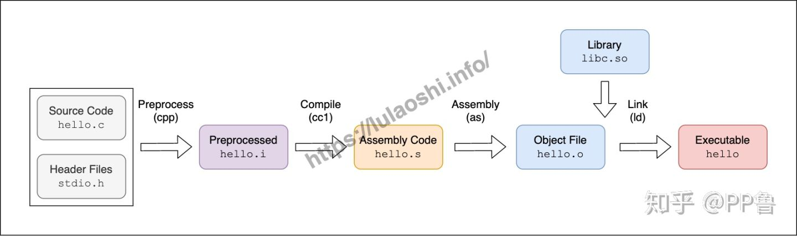

[TOC]


### 一、编译C代码流程

我们新建一个helloWorld.c文件，简单编写如下内容：

```
#include <stdio.h>

int main() {
	printf("helloWorld\n");
	return 0;
}
```

- stdio.h是C语言标准库预设的、现成的公共方法库文件（头文件），例如下面用到的printf方法（打印字符串到标准输出流）就被包含在内。
- main函数：程序入口，我们定义其返回值为int类型，所以最后返回了0，表示程序可正常执行结束，如果返回其它类型数据，程序则异常结束

但我们知道，计算机最终执行的都是二进制，因此需要编译器来转换C语言代码，形成最终的可执行文件（如.exe）。实际编码时，我们不仅会编写大量.c文件，还会引入不少第三方库，将这些内容生成可执行文件的过程，我们称之为“构建”。

复杂软件的构建过程往往包含如下流程：

- 从代码仓库（如git、svn）获取最新源码
- 编译当前源码成目标文件（二进制文件，GCC为.o、MSVC为.obj）、检查依赖项（如库文件）
- 单元测试
- 链接（Link）目标文件（.obj）与库文件（.lib）
- 生成可执行文件（如.exe）

此处我们重点关注编译的过程。编译一般分为四步：**预处理（Preprocess）、编译（Compile）、汇编（Assembly）和链接（Link）**




### 二、GCC编译器

GCC全称为GNU Compiler Collection，它是一系列编译器的集合，是Linux的核心组件之一。不过，GCC最初只是一款C语言编译器（当时叫做CNU C Compiler），只是随着时间的发展，陆续支持了C++、Go等语言，称为一个编译器集合。其拥有如下特性：

- 支持多语言编译，如g++编译C++、gfortran编译Fortran
- 支持不同平台硬件，可将源码编译成x86_64、ARM、PowerPC等架构平台的可执行文件
- 支持众多行业标准，能很快同步最新的C语言标注特性

为了更快更好地构建项目，我们还可以使用GCC的一些辅助工具，如：

- CNU Make：一款自动化编译和构建工具，常用语多文件、多模块的大型软件工程中
- GDB：GNU Debugger调试器
- CNU Binutils：一系列二进制工具集合，包含链接器ld、汇编器as等


#### 2.1 使用gcc编译hello.c

```
gcc hello.c
```

此时，所在目录会生成a.out的可执行文件，执行它即可

```
./a.out
```

当然，也可自定义命名可执行文件

```
// -o即为out输出
gcc hello.c -o xxx
```


#### 2.2 gcc编译过程详解


##### 2.2.1 预处理

使用预处理器cpp生成hello.i文件。注意，cpp是C Preprocess之意，而非C Plus Plus。

```
cpp hello.c -o hello.i
```

此阶段主要处理源码中以#开头的预编译指令，大致规则如下：

- 处理#include指令，将被包含的文件插入到该代码的位置。如果被包含的文件，还包含了其它文件，则会递归处理
- 处理#if、#ifdef、#elif、#else、#endif等条件指令
- 删除#define宏定义，并展开到引用位置
- 添加行号和文件名标识，以便在编译过程中产生编译错误、调试时生成行信息


##### 2.2.2 编译

这一过程主要是进行词法分析、语法分析、语义分析，然后编译成汇编语言文件（.s文件）。

```
gcc -S hello.i -o hello.s
```

这条命令会调用一个名为cc1的工具，只是因为它存放的路径在不同系统中（如Ubuntu为/usr/lib/gcc/x86_64-linux-gnu/5.4.0/cc1；华为鲲鹏ARM的OpenEuler为/usr/libexec/gcc/aarch64-linux-gnu/7.3.0/cc1）不统一，所以gcc内部分装后统一调用了。

汇编代码大致如下：

```
.file	"hello.i"
	.section	.rodata
.LC0:
	.string	"Hello World"
	.text
	.globl	main
	.type	main, @function
main:
.LFB0:
	.cfi_startproc
	pushq	%rbp
	.cfi_def_cfa_offset 16
	.cfi_offset 6, -16
	movq	%rsp, %rbp
	.cfi_def_cfa_register 6
	movl	$.LC0, %edi
	call	puts
	movl	$0, %eax
	popq	%rbp
	.cfi_def_cfa 7, 8
	ret
	.cfi_endproc
.LFE0:
	.size	main, .-main
	.ident	"GCC: (Ubuntu 5.4.0-6ubuntu1~16.04.12) 5.4.0 20160609"
	.section	.note.GNU-stack,"",@progbits
```


##### 2.2.3 汇编

再使用as工具将汇编语言转换成二进制机器码。

```
as hello.s -o hello.o
```

查看二进制机器码

```
xxd hello.o
```

结果如下：

```
00000000: 7f45 4c46 0201 0100 0000 0000 0000 0000  .ELF............
00000010: 0100 3e00 0100 0000 0000 0000 0000 0000  ..>.............
00000020: 0000 0000 0000 0000 a002 0000 0000 0000  ................
00000030: 0000 0000 4000 0000 0000 4000 0d00 0a00  ....@.....@.....
00000040: 5548 89e5 bf00 0000 00e8 0000 0000 b800  UH..............
00000050: 0000 005d c348 656c 6c6f 2057 6f72 6c64  ...].Hello World
00000060: 0000 4743 433a 2028 5562 756e 7475 2035  ..GCC: (Ubuntu 5
00000070: 2e34 2e30 2d36 7562 756e 7475 317e 3136  .4.0-6ubuntu1~16
00000080: 2e30 342e 3132 2920 352e 342e 3020 3230  .04.12) 5.4.0 20
...
...
```


##### 2.2.4 链接

二进制文件已生成，但依旧不能直接运行，因为还少了系统库的融入。例如，printf函数对应着汇编语言的call puts方法，它是一个外部函数，我们并不清楚它被放在内存中的那个地方，因此需要“链接”。

```
gcc hello.o -o hello
```

此命令使用了**动态链接**方式生成的hello可执行文件（内部用ld链接器来完成），等同于这条指令：

```
ld -o hello hello.o /usr/lib/x86_64-linux-gnu/crt1.o /usr/lib/x86_64-linux-gnu/crti.o /usr/lib/x86_64-linux-gnu/crtn.o -lc -dynamic-linker /lib64/ld-linux-x86_64.so.2
```

详解：

- crt1.o、crti.o和crtn.o三个库是处理main函数调用前和执行完后，操作系统协同的任务。

  > 在Linux中，一个新的程序都是由父进程调用`fork()`，生成一个子进程，然后再调用`execve()`，将可执行文件加载进来，才能被操作系统执行

- -lc：表示将搜索libc.so的动态链接

- ld-linux-x86_64.so.2：链接器ld本身所依赖的库

- -dynamic-linker：表示动态链接

如果需要比较hello.c链接前后的区别，可以使用objdump反汇编工具查看：

```
//链接前
objdump -dS hello.o

//链接后，生成ELF文件（Linux的可执行文件）
objdump -dS hello
```


### 三、动态链接与静态链接

前文提到了使用动态链接方式来生成最终的可执行文件，但其实还可以使用静态链接方式。大致代码为：

```
ld -static -o statichello hello.o -L`gcc --print-file-name=` /usr/lib/x86_64-linux-gnu/crt1.o /usr/lib/x86_64-linux-gnu/crti.o  /usr/lib/x86_64-linux-gnu/crtn.o --start-group -lc -lgcc -lgcc_eh --end-group
```

但不推荐这样做，因为你会发现构建后的可执行文件会很大。这又是为啥呢？

因为静态链接则在一开始就全部打包到一块了，相比之下，动态链接不会打包相关库到可执行文件上，而是记录用了哪些动态链接库，等到可执行文件运行到某个库的方法时，才装载进来（装载就是将磁盘上的程序和数据加载到内存中），两种方式构建后的文件体积差距可想而知。

另外，不同系统的动态链接库文件格式有所差别，Linux为.so（Shared Object，共享目标文件），Windows为.dll（Dynamic Link Library）


#### 3.1 SONAME文件命名规则

`so`文件后面往往跟着很多数字，这表示了不同的版本。`so`文件命名规则被称为SONAME：

```text
libname.so.x.y.z
```

lib是前缀，这是一个约定俗成的规则。x为主版本号（Major Version），y为次版本号（Minor Version），z为发布版本号（Release Version）。

- Major Version表示重大升级，不同Major Version之间的库是不兼容的。Major Version升级后，或者依赖旧Major Version的程序需要更新代码，重新编译，才可以在新的Major Version上运行；或者操作系统保留旧Major Version，使得老程序依然能运行。
- Minor Version表示增量更新，一般是增加了一些新接口，原来的接口不变。所以，在Major Version相同的情况下，Minor Version从高到低是兼容的。
- Release Version表示库的一些bug修复，性能改进等，不添加任何新的接口，不改变原来的接口。

但是我们刚刚看到的`.so`只有一个Major Version，因为这是一个软连接，`libname.so.x`软连接到了`libname.so.x.y.z`文件上。

```text
ls -l /lib/x86_64-linux-gnu/libpcre.so.3
/lib/x86_64-linux-gnu/libpcre.so.3 -> libpcre.so.3.13.2
```

因为不同的Major Version之间不兼容，而Minor Version和Release Version都是向下兼容的，软连接会指向Major Version相同，Minor Version和Release Version最高的`.so`文件上。


[1]: https://zhuanlan.zhihu.com/p/225749331	"Hello World背后的故事：如何在Linux上编译C语言程序"
[2]: https://zhuanlan.zhihu.com/p/235551437	"Linux的so文件到底是干嘛的？浅析Linux的动态链接库"

